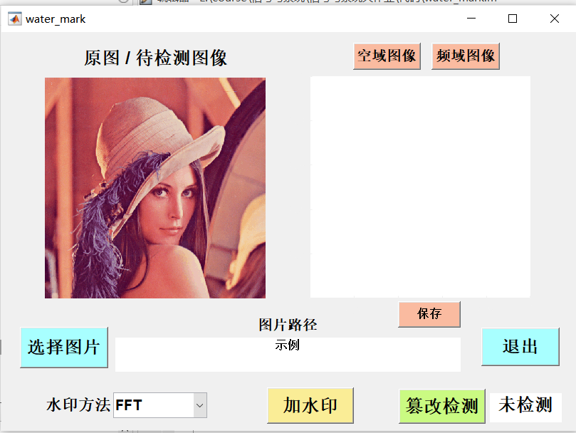
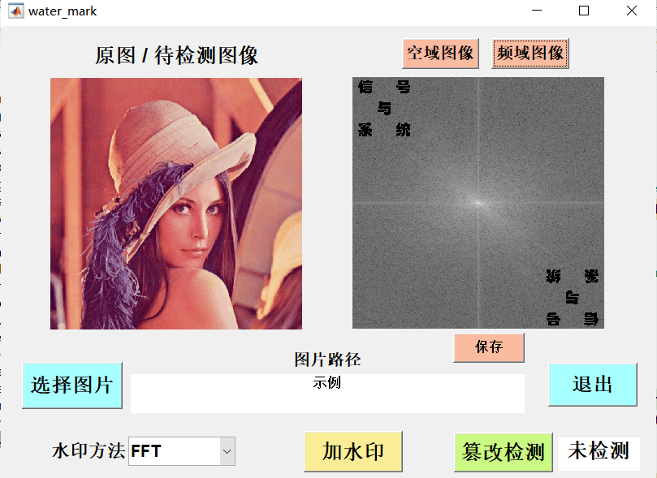
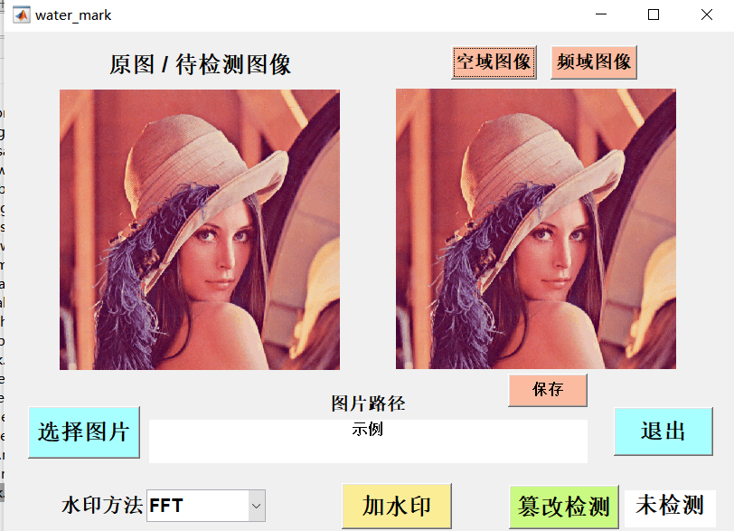

## Code List

1. `water_mark.m`
2. `water_mark.fig`
3. `fft_encode.m`
4. `fft_decode.m`
5. `dct_encode.m`
6. `dct_decode.m`
7. `dwt_encode.m`
8. `dwt_decode.m`

其中第一个为GUI界面代码，第二个为MATLAB中GUI的配置布局，其它六个函数是三种方法的编码解码函数。

## 其它文件

1. `lenna.bmp` 为测试图像
2. `standard3.png` 为水印图像
3. 提供了三种方法水印后的图像：`lenna_fft.bmp`, `lenna_dct.bmp`, `lenna_dwt.bmp`。
4. 提供了在三种变换后的篡改图像，分别为高斯噪声(gaussian)、椒盐噪声(saltpepper)、部分涂改(draw)，共九张图片，命名方式如下：

$$
lenna\\_方法\\_篡改途径.bmp
$$

5. 注意欲使用图片，那么代码与图片**必须在同一目录下**。这里为了规整所以新建了`pic`文件夹。

## 软件使用方法

打开`water_mark.m`并运行可以得到如下界面：

每个按钮具体作用均如按钮上所写。值得注意的是要**先选择左下角水印方法，在再行后续操作**。如`fft`的频域和空域。

在**篡改检测时**，**一定要**选择图片名称为`名称_xxx`的图片，尤其是`dct`和`dwt`，因为他们用到了原图，我在程序中是使用正则表达式匹配来获取原图名称的，因此**一定要有名称信息**再进行篡改监测。如检测`lenna_dct_white.bmp`文件。检测后即可通过右下角来判断是否篡改。

三种代码的具体内容与实现方式均在报告中。对于彩色图片，我们目前只在红色图层进行了水印覆盖，其实也可以选择三个图层均覆盖，只要重复红色图层操作即可。

<strong>2023.06.22</strong>

